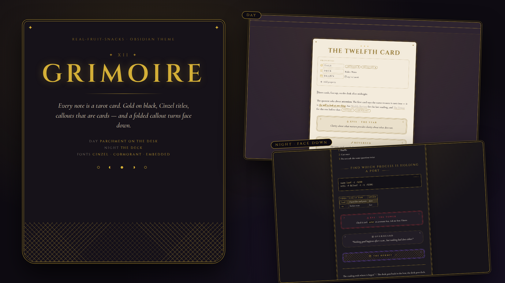
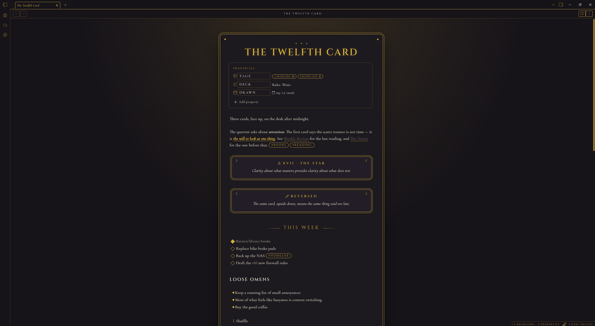
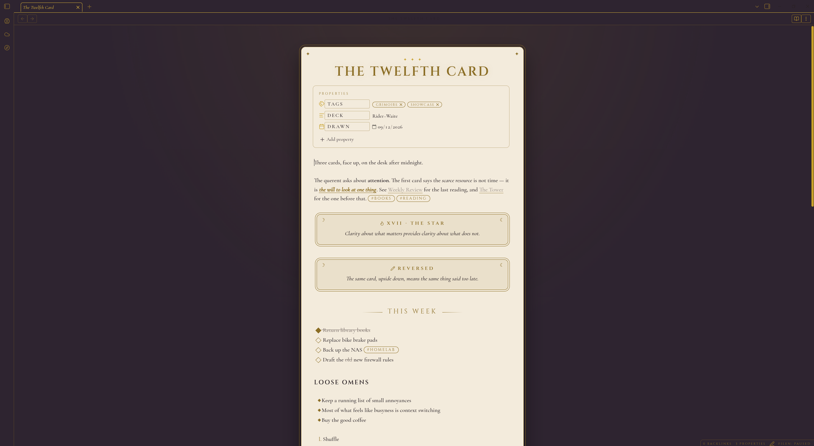

  

# Grimoire

Every note is a tarot card. Gold on black, Cinzel titles, Cormorant body, a double gold frame with stars in the corners — and one trick: **fold a callout and it turns face down.**

Callouts are cards too: framed, centred, moons in the corners, titled in gold small caps. Collapse one and it flips to a gold lattice card-back with the title on a label. Open it and the reading continues.

## What it does

- The note is a card: gold frame and outer hairline, rounded top, deep-rounded bottom, stars in the corners, on a dark desk with a faint gold glow
- Cinzel titles and headings — the title in gold with a soft glow under three stars, H2s centred between fading gold rules — with Cormorant Garamond body; both embedded, nothing to install
- Callouts are cards: gold frames for tips and notes, red for warnings, plum for questions, a rounder unframed card for quotes; all centred with moons in the corners
- Fold any callout and it turns face down: a gold lattice card-back, title on a label
- Diamond checkboxes that fill gold, gold oval tags and property pills, gold italic highlights, gold Cinzel table headers and list numbers, the code block as a black page with gold type
- The explorer is the deck: Cinzel folder labels flanked by stars, italic file names, a gold-ringed active file, moon phases at the foot
- Day mode: a parchment card on the same dark desk — sidebars and chrome stay night, only the card turns light. Night mode: the black-and-gold deck

  

  

## Install

**From the community list** — Settings → Appearance → Themes → Manage → search "Grimoire".

**Manually**

1. Download `theme.css` and `manifest.json` from the [latest release](https://github.com/Real-Fruit-Snacks/obsidian-grimoire/releases/latest).
2. Put them in `<your vault>/.obsidian/themes/Grimoire/`.
3. Settings → Appearance → Themes → Grimoire.

Readable line length on is recommended — the card sits in the glow at the centre of the desk.

## Palette

| Role | Night | Day |
|---|---|---|
| Desk | `#0E0B12` | `#2A1F2C` |
| Card | `#161219` | `#F3ECDD` |
| Ink | `#EAE2D0` | `#241A1F` |
| Gold | `#D4AF37` | `#8C6D1F` |
| Red | `#C8323F` | `#8E1B25` |
| Plum | `#8B5CF6` | `#6D3FB8` |

## Contributing

Issues and pull requests welcome. No build step: edit `theme.css`, reload Obsidian. `dev/` holds the same file with a note on where it goes in a vault.

## License

MIT. Fonts (Cinzel, Cormorant Garamond, IBM Plex Mono) are under the SIL Open Font License.
